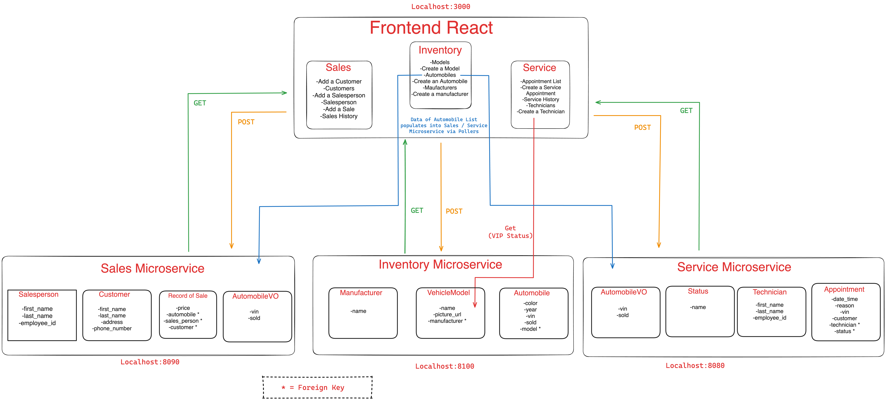

# CarCar

Team:

- Jeremy Kilcrease - Sales microservice
- Mazen Balasta - Service microservice

## Design

The design of this project is based on a microservices architecture, where each microservice is responsible for a specific functionality of the application. The project is divided into three main parts:

Frontend (React Application): The frontend of the application is built using React and is located in the ghi/app directory. It provides a user interface for interacting with the backend services. The frontend communicates with the backend services through HTTP requests.

Backend (Microservices): The backend of the application consists of three microservices: "Sales", "Inventory", and "Service". Each microservice is a Django application and is responsible for a specific part of the application's functionality:

-Sales Microservice: Manages sales-related data. It provides API endpoints for creating, retrieving, updating, and deleting sales records, salespeople, and customers. The code for this service is located in the sales/api directory.

-Inventory Microservice: Manages the inventory of automobiles. It provides API endpoints for creating, retrieving, updating, and deleting automobiles, manufacturers, and vehicle models. The code for this service is located in the inventory/api directory.

-Service Microservice: Manages service appointments for automobiles. It provides API endpoints for creating, retrieving, updating, and deleting service appointments and technicians. The code for this service is located in the service/api directory.

Database: Each microservice uses a PostgreSQL database for data storage. The database configuration for each service is located in the settings.py file in the respective microservice's directory.

Docker: The microservices and the frontend application are containerized using Docker, and the services are orchestrated using Docker Compose. The Docker configuration for each service is located in the Dockerfile.dev file in the respective service's directory, and the Docker Compose configuration is located in the docker-compose.yml file at the root of the project.

Polling Services: The backend also includes a polling service for each microservice, located in the poll directory of the respective microservice's directory. The polling services are responsible for periodically checking for updates in the microservices and synchronizing the data between them.

The design of this project allows for high scalability and maintainability, as each microservice can be developed, deployed, and scaled independently.


## Installation

1. Fork and clone the repository at https://gitlab.com/sjp19-public-resources/sjp-2022-april/project-beta
2. Run the following commands on your computer
```
docker volume create beta-data
docker-compose build
docker-compose up
```
3. When you run docker-compose up and if you're on macOS, you will see a warning about an environment variable named OS being missing. You can safely ignore this.

## Disclaimer

This application loads with an empty database. To fully interact with this application, please create at least one of the following in this order:

1. Manufacturer
2. Vehicle model
3. Automobile
4. Sales person
5. Customers
6. Sale
7. Technician
8. Appointment

## Service microservice

**Description**
The Service microservice is responsible for managing service appointments for automobiles. It also has a poller in place that fetches data from our Inventory Automobiles that automatically updates the AutomobileVO Model with the VINs of all the automobile we've ever had in sctock and it's sold status, either true (automobile is sold) or false(automobile is still in stock). It consists of several models defined in the service/api/service_rest/models.py file:

- AutomobileVO
- Technician
- Appointment
- Status

**Models:**

Here are the four models included in the service microservice along with their functionalies:

- AutomobileVO: This model represents an automobile in the inventory. It has a vin field for the Vehicle Identification Number, which is unique for each automobile, and a sold field to indicate whether the automobile has been sold. These fields are polled from our inventory microservice using a poller that fetches data evey 60 seconds. These fields are only a mirror of the Inventory Automobile model which means we will not be editing it within the Service Microservice. Only a Get request for the list of automobiles is provided.

- Technician: This model represents a technicain employed. It has a first_name field for the technician's first name, a last_name field for the technicians last name, and an employee_id field for the technicians employee_id (this is different from the Model's id).

- Appointment: This model represents a service appointment. It has fields for the date and time of the appointment (date_time), the reason for the appointment (reason), the VIN of the automobile being serviced (vin), and the customer’s name (customer). It also has a foreign key to the Technician model (technician) and a foreign key to the Status model (status).

- Status: the Status model represents different states or conditions that an Appointment can have. It's a common practice to use a separate model for representing status, especially when the status can be a finite set of values and might have associated behaviors or meanings. This Status model has a single field name, which is a character field with a maximum length of 10 characters. The name field is meant to store the actual status of the Appointment, such as "created," "finished," "cancelled".

### URLs
***Technician***

| Action | Method | URL
| ----------- | ----------- | ----------- |
| List technicians | GET | http://localhost:8080/api/technicians/
| Technician detail | GET | http://localhost:8080/api/technicians/<int:pk>/
| Create a technician | POST | http://localhost:8080/api/technicians/
| Delete a technician | DELETE | http://localhost:8080/api/technicians/<int:pk>/

LIST TECHNICIANS: This will provide you the list of all emplyed technicians. A Get request requires no body.

Here's an example of what the returned data will look like:

```
"technicians": [
		{
			"href": "/api/technicians/1/",
			"employee_id": "Emp12345",
			"first_name": "John",
			"last_name": "Doe",
			"id": 1
		},
		{
			"href": "/api/technicians/2/",
			"employee_id": "0212225",
			"first_name": "Susan ",
			"last_name": "Wheeler",
			"id": 2
		},
```

TECHNICIAN DETAIL: Another Get request. Will provide the same information as List technician but for individual technicians. Replace <int:pk> with the technicians id number. If the id number provided does not exist, you will get a 400 status meaning it was a bad request and this message will be returned:

```
Example bad request:
{
	"message": "Invalid technician ID, please ensure url has an existing technician id"
}
```

CREATE A TECHNICIAN: This is a post request which means you'll need to include a jason body that consists of relevant information to create a Technician.

Here is what you'll need to create a technician just fill in the "":

```
{
	"employee_id": "",
	"first_name": "",
	"last_name": ""
}
```

DELETE TECHNICIAN: All you'll need to send is a delete request along with the technicians model id. A status 200 (delete successfull) of a status 400 (delete unsuccessfull) will be returned depending if the provided id exist or not.

Here are examples of good and bad requests:

```
{
	"deleted": true,
	"message": "Technician deleted successfully"
}
```
```
{
	"deleted": false,
	"message": "Technician not found"
}
```

***Appointment***

| Action | Method | URL
| ----------- | ----------- | ----------- |
| List appointments | GET | http://localhost:8080/api/appointments/
| Appointment detail | GET | http://localhost:8080/api/appointments/<int:pk>/
| Create an appointment | POST | http://localhost:8080/api/appointments/
| Delete an appointment | DELETE | http://localhost:8080/api/appontments/<int:pk>/
| Set appointment status to "finished" | DELETE | http://localhost:8080/api/appointments/<int:pk>/
| Set appointment status to "cancelled" | DELETE | http://localhost:8080/api/appointments/<int:pk>/

LIST APPOINTMENTS: Another Get request, this will return the following list of appointments response:

```
Example:
{
	"appointments": [
		{
			"href": "/api/appointments/6/",
			"vin": "Test",
			"customer": "Test",
			"date_time": "2023-01-15T10:30:00",
			"technician": {
				"href": "/api/technicians/1/",
				"employee_id": "Emp12345",
				"first_name": "John",
				"last_name": "Doe"
			},
			"reason": "test",
			"id": 6,
			"status": "finished"
		},
		{
			"href": "/api/appointments/7/",
			"vin": "Test",
			"customer": "Test",
			"date_time": "2023-01-15T10:30:00",
			"technician": {
				"href": "/api/technicians/1/",
				"employee_id": "Emp12345",
				"first_name": "John",
				"last_name": "Doe"
			},
			"reason": "test",
			"id": 7,
			"status": "finished"
		},
  ]
}
```
The technician object represents the technician assigned to this appointment.

APPOINTMENT DETAIL: this will show the same response but for specific appointments. Replace <int:pk> with Model id of the appointment you want to show.

CREATE AN APPOINTMENT: Will require a body.

Replace the following "" with craete values. Technician field will be a number and not a string that represents the id of technician you want assigned to this appointment and date_time field will be a string in this format "YYYY-MM-DDTHH:MM:SS":

```
Example:
{
	"vin": "",
	"customer": "",
	"date_time": "2023-12-22T10:30:00",
	"technician": ,
	"reason": ""
}
```

DELETE AN APPOINTMENT: Delete request, no body needed. Provide url with id of appointment you want to delete. A status 200 (delete successfull) of a status 400 (delete unsuccessfull) will be returned depending in the provided id exist or not.

Here are examples of good and bad requests:

```
{
	"deleted": true,
	"message": "Appointment deleted successfully"
}
```
```
{
	"deleted": false,
	"message": "Appointment not found"
}
```

SET APPOINTMENT STATUS TO "FINISHED": A put request that requires no body. Sending this request will change the status of appointment to finished. replace <id:pk> with id of appointment you want to finish. Response will show the same data as Appointment Detail except the status will be changed to "finished".

SET APPOINTMENT STATUS TO "CANCELLED": A put request that requires no body. Sending this request will change the status of appointment to finished. replace <id:pk> with id of appointment you want to cancel. Response will show the same data as Appointment Detail except the status will be changed to "cancelled".

**AutomobileVO**

| Action | Method | URL
| ----------- | ----------- | ----------- |
| List automobiles | GET | http://localhost:8080/api/automobiles/

LIST AUTOMOBILES: A Get request that returns a response containing all the VINs of Inventory Automobiles along with their sold status.

```
Example:
{
	"autos": [
		{
			"vin": "SampleVin12345",
			"sold": false
		},
		{
			"vin": "1C3CC5FB2AN120174",
			"sold": true
		},
		{
			"vin": "5TDZT34A65S248163",
			"sold": false
		}
	]
}
```

## Sales microservice

**Description:**
The Sales microservice integrates with the Inventory microservice through the AutomobileVO model. When an automobile is sold, the sold field of the corresponding AutomobileVO instance is updated to True. This change is then propagated to the Inventory microservice, which updates its own record of the automobile's status.

The Sales microservice also exposes several API endpoints for creating, retrieving, updating, and deleting sales records, salespeople, and customers. These endpoints are defined in the sales/api/sales_rest/views.py file.

**Models:**
The Sales microservice in your application is primarily responsible for managing sales-related data. It consists of several models defined in the sales/api/sales_rest/models.py file:

-AutomobileVO: This model represents an automobile in the inventory. It has a vin field for the Vehicle Identification Number, which is unique for each automobile, and a sold field to indicate whether the automobile has been sold.

-SalesPerson: This model represents a salesperson. It contains information about the salesperson.

-Customer: This model represents a customer. It contains information about the customer.

-RecordOfSale: This model represents a record of a sale. It contains the price of the sale, and foreign keys to the AutomobileVO, SalesPerson, and Customer involved in the sale.

**URLs:**

- GET: http://localhost:8090/api/salespeople/ (Shows all salespeople)
- POST: http://localhost:8090/api/salespeople/ (Create a salesperson)
- DELETE: http://localhost:8090/api/salespeople/:id/ (Delete a salesperson)
- GET: http://localhost:8090/api/customers/ (Shows all customers)
- POST: http://localhost:8090/api/customers/ (Create a customer)
- DELETE: http://localhost:8090/api/customers/:id/ (Delete a customer)
- GET: http://localhost:8090/api/sales/ (Shows all the sales)
- POST: http://localhost:8090/api/sales/ (Create a sale)
- DELETE: http://localhost:8090/api/sales/:id (Delete a sale)

**Sample Data in JSON:**

- Create a salesperson:

```
{
	"name": "Jimmy Jon",
	"employee_number": 123
}
```

- Create a customer:

```
{
    "first_name": "Jimbo",
    "last_name": "Fisher",
    "address": "210 red ln, austin, tx, 78681",
    "phone_number": 2103243287
}
```

- Create a sale:

```
{
    "price": 130,
    "automobile": "sampleVIN123",
    "sales_person": "1",
    "customer": "1"
}
```

## Inventory microservice

The Inventory microservice in your application is primarily responsible for managing the inventory of automobiles. It consists of several models defined in the inventory/api/inventory_rest/models.py file:

-Manufacturer: This model represents a car manufacturer. It has a name field which is a unique string representing the name of the manufacturer.

-VehicleModel: This model represents a model of a vehicle. It has a name field for the model name, a picture_url field for the URL of the model's picture, and a manufacturer field which is a foreign key to the Manufacturer model. This means each VehicleModel is associated with a Manufacturer.

-Automobile: This model represents an automobile in the inventory. It has several fields including color, year, vin (Vehicle Identification Number), sold (a boolean indicating whether the automobile has been sold), and model which is a foreign key to the VehicleModel model. This means each Automobile is associated with a VehicleModel.

The Inventory microservice exposes several API endpoints for creating, retrieving, updating, and deleting automobiles, manufacturers, and vehicle models. These endpoints are defined in the inventory/api/inventory_rest/views.py file.

The Inventory microservice integrates with the rest of the project through these models and API endpoints. For example, the Sales microservice can retrieve information about automobiles in the inventory by making a GET request to the appropriate endpoint in the Inventory microservice. When an automobile is sold, the Sales microservice can update the sold field of the corresponding Automobile instance in the Inventory microservice by making a PUT request to the appropriate endpoint.

**URLs:**

- GET: http://localhost:8100/api/manufacturers/ (Shows all manufacturers)
- POST: http://localhost:8100/api/manufacturers/ (Create a manufacturer)
- GET: http://localhost:8100/api/manufacturers/:id/ (Show a specific manufacturer)
- POST: http://localhost:8100/api/manufacturers/:id/ (Update a specific manufacturer)
- DELETE: http://localhost:8100/api/manufacturers/:id/ (Delete a specific manufacturer)
- GET: http://localhost:8100/api/models/ (Shows all vehicle models)
- POST: http://localhost:8100/api/models/ (Create a vehicle model)
- GET: http://localhost:8100/api/models/:id/ (Show a specific vehicle model)
- PUT: http://localhost:8100/api/models/:id/ (Update a specific vehicle model)
- DELETE: http://localhost:8100/api/models/:id/ (Delete a specific vehicle model)
- GET: http://localhost:8100/api/automobiles/ (Shows all automobiles)
- POST: http://localhost:8100/api/automobiles/ (create an automobile)
- GET: http://localhost:8100/api/automobiles/:vin/ (Show a specific automobile)
- PUT: http://localhost:8100/api/automobiles/:vin/ (Update a specific automobile)
- DELETE: http://localhost:8100/api/automobiles/:vin/ (Delete a specific automobile)

**Sample Data in JSON:**

- Create a manufacturer

```
{
  "name": "Dodge"
}

```

- Create a vehicle model

```
{
  "name": "Mammoth",
  "picture_url": "https://sample.com",
  "manufacturer_id": 3
}
```

- Create an automobile

```
{
  "color": "Black",
  "year": 2024,
  "vin": "sampleVIN123",
  "model_id": 4
}
```
